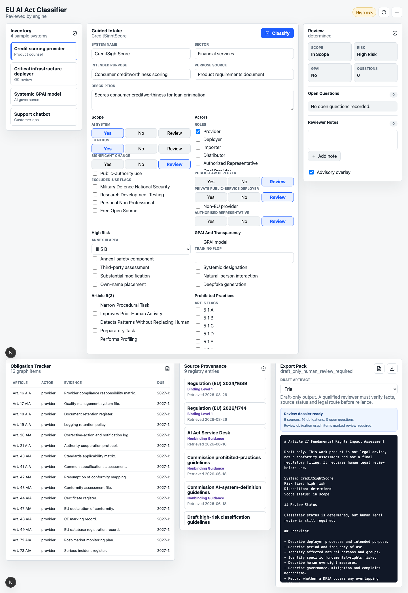

# eu-ai-act-classifier

See [CASE_STUDY.md](CASE_STUDY.md) for the problem, controls, and limitations.

Deterministic EU AI Act first-pass classifier -- cited risk tiers, obligations, timelines, review status; CLI + MCP-style tools. Not legal advice; data is synthetic.

> **If you don't code:** scroll to [What the demo produces](#what-the-demo-produces). This repo ships a sample output you can read in the browser. The point isn't the code; it's whether the legal work is structured, cited, reviewable, and testable.


## Run it

```bash
git clone https://github.com/sebastianfoerste/eu-ai-act-classifier
cd eu-ai-act-classifier
uv sync
uv run python -m src.eu_ai_act_classifier.cli examples/credit_scoring.json
```

Runs end to end, offline and deterministically.

## What the demo produces

The classifier runs a gates-based review over a system profile and outputs a high-contrast report detailing the risk tier, binding timeline, regulatory sources, and applicable obligations. You can read the committed sample output: [`examples/classification-packet.md`](examples/classification-packet.md) and [`examples/classification-packet.json`](examples/classification-packet.json).

```markdown
EU AI Act classification: CreditSightScore
Risk tier: HIGH-RISK (Art. 6 AIA)
Disposition: DETERMINED
Scope status: in_scope
Roles: provider

Obligations:
  - Art. 9 AIA: Risk management system. Establish, document and maintain a continuous risk management system.
  - Art. 10 AIA: Data and data governance. Apply data governance to training, validation and testing data sets.
  - Art. 11 AIA: Technical documentation. Draw up technical documentation (Annex IV) before placing on the market.
```

In the sample run, every tier and obligation is cited to an Article and carries an explicit review status.

## What it checks / does

| Gates / Steps | Focus | Verification Method |
|---|---|---|
| Scope and Intake | Alignment | Checks AI-system status, EU nexus, and transitional dates |
| Prohibited Practices | Art. 5 verification | Flags prohibited use cases (e.g. biometric categorization, social scoring) |
| High-Risk & GPAI | Art. 6 / Annex III / GPAI | Classifies obligations based on deployment areas and compute scale |

---

> **What workflow does this improve?** Fast, source-grounded regulatory screening for AI systems.
> **Who is the user?** AI Governance, Legal Ops, and Compliance teams.
> **Where does human review happen?** Always. Flags indicating `review_required` highlight factual areas that need legal judgment.
> **What is blocked until approval?** Deployment and compliance certification.
> **What would I tell Product?** Which features (e.g., scoring, profiling) trigger the "High-Risk" tier so they can design around them.
```

## What It Does

The engine runs six gates over a typed `SystemProfile`.

1. Scope and intake: AI-system status, intended-purpose source, EU nexus,
   excluded-use flags, placement dates, significant changes and public-authority
   use.
2. Prohibited practices: Art. 5 AIA.
3. High-risk classification: Art. 6, Annex I and Annex III.
4. General-purpose AI models: Arts. 51, 53, 55 and 56 AIA.
5. Transparency: Art. 50 AIA.
6. Resolution: risk tier, disposition, obligation graph, timeline and open
   legal questions.

Existing alpha profiles remain compatible. Missing new scope fields default to
an in-scope AI system so the original 14 synthetic examples keep their expected
results.

## Reviewer Demo Path

Use the CLI first. It is the authoritative product surface and does not require
web dependencies:

```bash
uv run pytest
uv run eu-ai-act-classify examples/credit_scoring.json --strict
uv run eu-ai-act-classify examples/credit_scoring.json --sources
uv run eu-ai-act-classify examples/credit_scoring.json \
  --artifact all \
  --artifacts-dir /tmp/eu-ai-act-draft-pack
```

Then inspect `/tmp/eu-ai-act-draft-pack`. The generated files are draft review
artifacts, not legal opinions, conformity assessments or filing documents.

Run the optional cockpit only after the Python checks pass:

```bash
cd web
npm install
npm run build
npm run dev
```

The cockpit is a local reviewer interface over the Python bridge. It does not
change the classifier result and it does not persist client or matter data.

## Source Statuses

Reports and draft artifacts use a versioned source manifest.

Binding Level 1 text:
Regulation (EU) 2024/1689 and the Art. 113 application timeline.

Provisional political agreement:
The AI Omnibus political agreement, including 2 December 2027 for Annex III
high-risk systems and 2 August 2028 for product-embedded high-risk systems.
These dates are labelled provisional until formal adoption and Official Journal
publication.

Nonbinding guidance:
Commission prohibited-practices guidance, AI-system-definition guidance, draft
high-risk guidance, AI Act Service Desk materials, the GPAI Code of Practice,
GPAI provider guidance and future transparency guidance.

Guidance overlays are advisory notes. They do not override the binding
classification logic.

## Risk-Tier Map

| Tier | Trigger | Citation | Obligation | Review status |
| --- | --- | --- | --- | --- |
| Prohibited | Art. 5 practice, such as social scoring | Art. 5 AIA | Do not place, put into service or use | Blocker, legal review required |
| High risk | Annex I product route or Annex III area | Art. 6, Annex I, Annex III AIA | Provider, deployer and value-chain obligations | Determined or requires review |
| GPAI | General-purpose AI model facts | Arts. 51, 53, 55 and 56 AIA | GPAI provider documentation and systemic-risk duties | Determined or requires review |
| Limited risk | Transparency-only system | Art. 50 AIA | User-facing transparency duties | Determined |
| Minimal risk | No higher-tier trigger | No specific higher-tier trigger | No classifier-derived AIA duty | Determined, keep governance record |
| Requires review | Ambiguous facts or unverified legal route | Depends on open question | Route to qualified reviewer | Human review required |

## Outputs

`ClassificationReport` contains:

1. Risk tier and disposition.
2. Scope assessment and transitional notes.
3. Findings with citation status.
4. Backward-compatible obligation, documentation and transparency fields.
5. Structured `obligation_graph` items with trigger, actor, evidence artifact,
   application date, review status and source metadata.
6. Binding and provisional timelines rendered separately.
7. Source manifest with URL, retrieval date, legal status, citation label and
   implementation note.
8. Optional advisory overlay notes.
9. Open legal questions and unverified citations.

## Quick Start

```bash
uv venv
uv pip install -e ".[dev]"

eu-ai-act-classify examples/cv_screening.json
eu-ai-act-classify examples/foundation_model_systemic.json --json
cat examples/credit_scoring.json | eu-ai-act-classify -
eu-ai-act-classify examples/employment_derogation.json --strict
```

Use `--advisory` to include nonbinding guidance notes.

Use `--sources` to emit the source manifest as JSON.

Generate draft work products only when an output directory is supplied:

```bash
eu-ai-act-classify examples/credit_scoring.json \
  --artifact all \
  --artifacts-dir ./draft-artifacts
```

Available artifact names:

1. `art-6-4-assessment`
2. `fria`
3. `annex-iv-checklist`
4. `post-market-monitoring-plan`
5. `serious-incident-register`
6. `gpai-model-documentation`
7. `training-content-summary`

Artifacts are drafts. They are not legal advice, not conformity assessments and
not final regulatory filings.

Generate a complete draft review dossier bundle with report JSON, source
manifest, open questions, obligation graph summary and draft artifacts:

```bash
eu-ai-act-classify examples/credit_scoring.json \
  --dossier-dir ./review-dossier
```

## MCP And Local API

The MCP server remains available:

```bash
uv pip install -e ".[mcp]"
python -m eu_ai_act_classifier.mcp_server
```

The local JSON bridge is used by the optional web cockpit:

```bash
eu-ai-act-local-api schema
eu-ai-act-local-api inventory
echo '{"profile":{"name":"x"}}' | eu-ai-act-local-api classify
echo '{"profile":{"name":"x"}}' | eu-ai-act-local-api dossier
```

The bridge exposes schema, inventory, classify, sources, artifacts and dossier commands.
It keeps the Python classifier as the legal source of truth.

The inventory payload includes a Legora-inspired aOS review profile under
`eu-ai-act-classifier.system-aos-review.v1`. It is a product pattern only, with
no Legora integration or dependency. External action is blocked and all
deployment, regulator, customer and public-facing use remains review-gated.

## Optional Web Cockpit



The `web/` folder contains a local Next.js App Router cockpit with:

1. System inventory.
2. Guided questionnaire.
3. Risk map.
4. Open legal questions.
5. Reviewer notes.
6. Source provenance.
7. Obligation tracker.
8. Export pack preview.
9. System aOS review profile.

Run it locally:

```bash
cd web
npm install
npm run dev
```

The web app uses in-memory state for v1. It does not persist client, matter,
candidate, account or privileged data.

The cockpit now shows loading, bridge-error and empty-artifact states explicitly.
If the local JSON bridge fails, retry metadata or run the CLI commands above to
separate a UI issue from a classifier issue.

Route surface:

1. `GET /api/health`
2. `GET /api/schema`
3. `POST /api/classify`
4. `GET /api/sources`
5. `POST /api/artifacts`
6. `POST /api/dossier`
7. `GET /api/inventory`

## Eval Set

`examples/` holds 14 synthetic systems spanning prohibited, high-risk, limited
risk, minimal risk, GPAI and review-required cases. The expected results are
asserted in `tests/test_examples.py`.

`examples/guidance/` holds Commission-derived guidance examples and stored beta
Compliance Checker comparisons. They are nonbinding review evidence and are
tested separately from the binding classifier logic.

See [examples/README.md](examples/README.md) and
[docs/launch-readiness.md](docs/launch-readiness.md).

## Optional Cockpit Snapshot

The web cockpit is an optional reviewer surface. The Python classifier remains
the legal source of truth.

```text
Inventory -> Guided intake -> Python classify bridge -> Risk map
          -> Open questions -> Source provenance -> Obligation tracker
          -> Draft export preview

Current sample:
System: CreditSightScore
Tier: high_risk
Disposition: determined
Primary citation: Annex III(5)(b) AIA
Review note: draft only, lawyer review before reliance
```

## Known Legal Limits

- Guidance changes. Commission, AI Office and national materials can change and
  remain nonbinding unless adopted through the relevant legal route.
- National implementation. Market-surveillance practice, penalties and
  notified-body practice may vary by Member State.
- Fact dependency. The engine applies rules to characterised facts; it does not
  decide disputed intended purpose, operator role or factual deployment scope.
- Lawyer review. `requires_review`, draft artifacts and advisory overlays must
  be reviewed before reliance.

## Stack

Python 3.13+, Pydantic v2, pytest, ruff and uv for the classifier.

Next.js App Router, React and lucide-react for the optional local cockpit.

The core classifier has one runtime dependency. MCP and the web cockpit remain
optional surfaces.

## Safety

This is a screening tool for supervised legal review. It does not produce legal
advice, a conformity assessment or a binding regulatory conclusion.

Determinations marked `requires_review` turn on facts the engine cannot settle.
Generated work products require human legal review before use.

See [Deterministic Classification Versus Legal Advice](docs/deterministic-classification-vs-legal-advice.md).

## Reviewer Checklist

Use this checklist when evaluating the repository as a portfolio project or employer demo:

- [ ] Run `uv run pytest` - 74 tests pass with no external dependencies.
- [ ] Run `uv run eu-ai-act-classify examples/credit_scoring.json --strict` - CLI produces risk tier, disposition and obligation graph.
- [ ] Run `uv run eu-ai-act-classify examples/credit_scoring.json --sources` - source manifest shows binding, provisional and advisory separation.
- [ ] Run `uv run eu-ai-act-classify examples/credit_scoring.json --artifact all --artifacts-dir /tmp/eu-ai-act-draft-pack` - draft artifact pack written to `/tmp`.
- [ ] Run `uv run eu-ai-act-classify examples/credit_scoring.json --dossier-dir /tmp/eu-ai-act-review-dossier` - review dossier bundle written to `/tmp`.
- [ ] Review `tests/test_local_api.py` - confirms `review_status: draft_only_human_review_required` on all artifact outputs.
- [ ] Review `docs/deterministic-classification-vs-legal-advice.md` - confirms classification logic and legal limits.
- [ ] Review `docs/sample-output.md` - confirms report language is review-gated.
- [ ] Review [docs/sample-review-dossier.md](docs/sample-review-dossier.md) - confirms synthetic review dossier with CLI outputs.
- [ ] Review `PRIVACY.md` - confirm synthetic-only demo boundary.
- [ ] Confirm all 14 synthetic example profiles still produce their expected classification tier.


## License

MIT. See [LICENSE](LICENSE).

## Human-authored legal judgment
AI tools assisted the implementation, but the parts that carry the value are
human-authored: the Annex/Article mappings, the obligation set, and the prohibited-practice
and review-status logic. The point of this repository is not code volume; it is showing
how legal judgment can be made structured, testable, and reviewable.

## Why this matters
"Is our system high-risk under the AI Act?" is asked constantly and answered badly.
This gives a structured first pass: cited risk tier, triggered obligations, timeline,
and an explicit review status that flags the genuine judgment calls for a lawyer.

## Known limitations
A first-pass classifier over a structured description; not legal advice.
1. Does not read product documentation or resolve the flagged judgment calls.
2. The Annex/Article mapping is illustrative; confirm against the current text and
   guidance.
3. Single-pass classification; no conformity-assessment workflow yet.
Next production step: a conformity-assessment checklist for confirmed high-risk
systems and evidence/template links per obligation.
