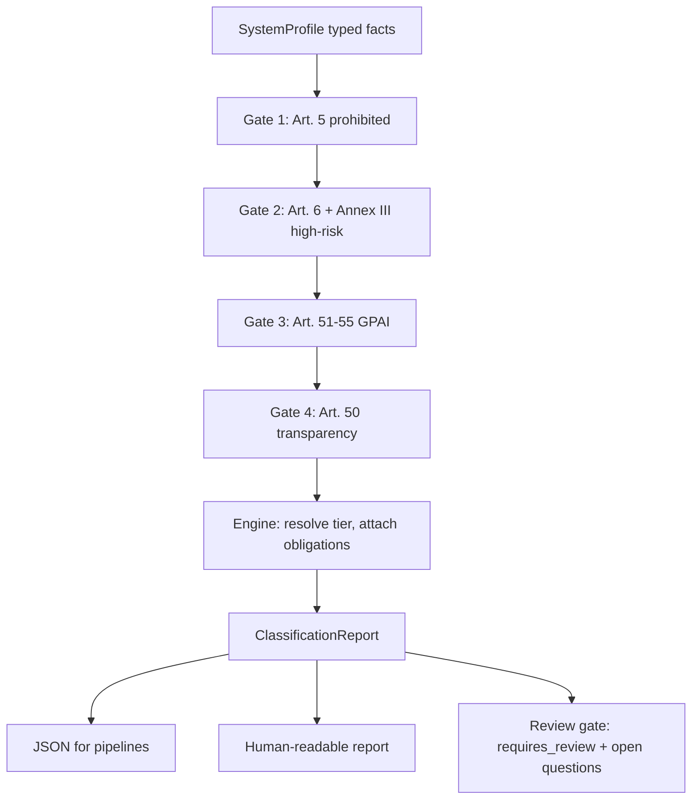

# EU AI Act Classifier

A deterministic engine that classifies an AI system under the EU AI Act
(Regulation (EU) 2024/1689) and returns the risk tier, the obligations that
attach with pinpoint article citations, the documentation a provider or
deployer must hold, and an explicit lawyer-review gate for the calls that turn
on facts the engine cannot settle. CLI and Python library; an optional MCP
server makes it callable by an agent.

It answers the question a general counsel at an AI-native company faces every
week: *is this feature high-risk, and what do we owe?* It does so as testable
software instead of a recurring manual read-through. It is a screening tool that
a practising lawyer supervises. It is not legal advice, and it does not produce
a conformity assessment.

## What it does

Five gates run in order over a typed system profile:

1. **Prohibited practices**: Art. 5 AIA. A hit is a hard stop.
2. **High-risk**: Art. 6 + Annex III, including the Art. 6(3) derogation and the profiling carve-out that forecloses it.
3. **General-purpose AI models**: Art. 51-55 AIA, with the 10^25 FLOP systemic-risk presumption.
4. **Transparency**: Art. 50 AIA, stacked on top of any tier.
5. **Minimal**: the default.

The output is a `ClassificationReport`: tier, role, findings with citation and
severity, the obligation set, the documentation to maintain, the transparency
duties, the Art. 113 application timeline, and, where a fact must be characterised
by a lawyer, a `requires_review` disposition naming the open question.

## Architecture



The engine is generic. The substance, namely which use case is which Annex III
point and which article carries which duty, lives in `catalog.py` and the gate
modules. That split is deliberate: the rule sets are the lawyer's contribution;
the engine only subsumes characterised facts under them. Every line of output
traces to a provision a reviewer can open.

## The review gate

The engine does not bluff. Two honesty mechanisms are built into the output:

- **`requires_review`**: when a determination turns on a fact the engine cannot
  settle, such as an asserted Art. 6(3) derogation, an undisclosed
  training-compute figure or a deployer's entity type for the Art. 27 FRIA, the
  engine refuses to assert a conclusion and names the open question.
- **`unverified citation, pending source check`**: a citation that is not
  confirmed against the consolidated EUR-Lex text is flagged in the output, not
  silently asserted. Currently this is the residual catch-all for an Annex III
  area whose specific point is unsettled; areas 6 and 7 sub-points are verified.

## Quick start

```bash
uv venv && uv pip install -e ".[dev]"

eu-ai-act-classify examples/cv_screening.json            # human-readable report
eu-ai-act-classify examples/foundation_model_systemic.json --json
cat examples/credit_scoring.json | eu-ai-act-classify -  # read from stdin
eu-ai-act-classify examples/employment_derogation.json --strict   # exit 1 on prohibited / requires_review
```

`--strict` lets the classifier sit in a CI step or a product-intake pipeline as
a quality gate, the way a linter does.

## Use it as an agent tool (MCP)

```bash
uv pip install -e ".[mcp]"
python -m eu_ai_act_classifier.mcp_server
```

The server exposes `classify_ai_system` (returns the structured report) and
`classify_ai_system_text` (returns the rendered report). A product-intake agent
can call it with a system profile and get back a cited, tiered, review-gated
classification: the legal layer as a callable tool.

## The eval set

`examples/` holds 14 worked systems spanning every tier: a CV screener, a
support chatbot, a credit-scoring model, an emotion-recognition hiring tool, a
foundation model above the systemic-risk threshold and a derogation edge case.
Each ships with its expected classification and is asserted on every test run
(`tests/test_examples.py`), so a rule change that moves any of them fails the
build. See [`examples/README.md`](examples/README.md) and
[`docs/launch-readiness.md`](docs/launch-readiness.md).

## How the law is encoded

Citations are pinpoint and follow the convention `Art. 6(2) AIA`,
`Annex III(5)(b) AIA`. The classifier works at Level 1, the Regulation. Level 2
delegated acts and Level 3 guidance, including Commission guidelines and the
GPAI Code of Practice, are out of scope and noted as such. Nothing is invented:
an uncertain pinpoint is flagged, never guessed.

## Stack

Python 3.12+, Pydantic v2 for typed models, standard library for everything
else. The core has one dependency. uv, pytest, ruff, GitHub Actions CI. The MCP
server is an optional extra.

## Status and scope

Alpha. The five gates cover the classification architecture end-to-end; the
Annex III sub-point coverage and the obligation catalogs are complete for the
common cases and explicit about their edges. Not in scope: Level 2/3 instruments,
conformity-assessment workflow, and any claim to replace legal judgment.

This is a screening tool, not legal advice. Determinations marked
`requires_review` turn on facts the engine cannot settle.

## License

MIT. See [LICENSE](LICENSE).