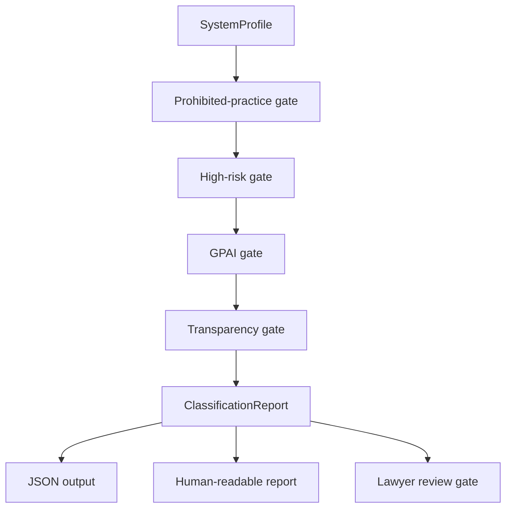

# Launch Readiness

This note helps a reviewer evaluate the EU AI Act Classifier quickly.

## What this repo proves

The classifier turns Regulation (EU) 2024/1689 into a deterministic screening
function. A typed `SystemProfile` produces a cited `ClassificationReport` with
risk tier, role-specific obligations, documentation duties, application
timeline and open legal questions.

The core proof is legal engineering discipline: characterised facts in,
pinpoint citations out, and a review gate where the engine cannot settle the
fact pattern.

## Architecture



## Local launch path

```bash
uv venv
uv pip install -e ".[dev]"
eu-ai-act-classify examples/cv_screening.json
eu-ai-act-classify examples/foundation_model_systemic.json --json
eu-ai-act-classify examples/employment_derogation.json --strict
```

## Checks

```bash
uv run ruff check .
uv run ruff format --check .
uv run pytest
```

## Sample data rule

Use synthetic AI-system profiles only. Do not add client product designs,
privileged risk assessments, internal launch materials or personal data to the
example set.

## Safety posture

This is a screening tool for supervised legal review. It does not produce legal
advice, a conformity assessment or a binding regulatory conclusion.

## Good evaluator route

A reviewer should inspect `README.md`, `docs/methodology.md`, `catalog.py`,
the gate modules, `examples/`, `tests/test_examples.py` and the CLI. The key
signal is that legal uncertainty remains visible through `requires_review` and
`unverified_citations`.
